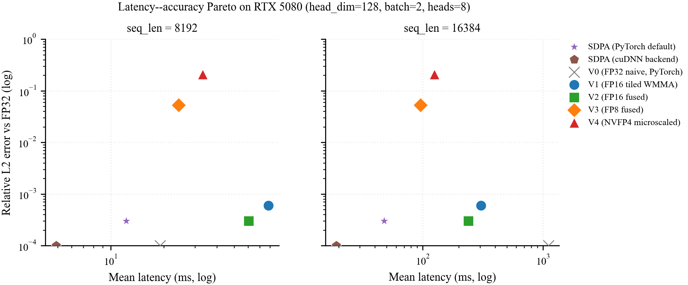
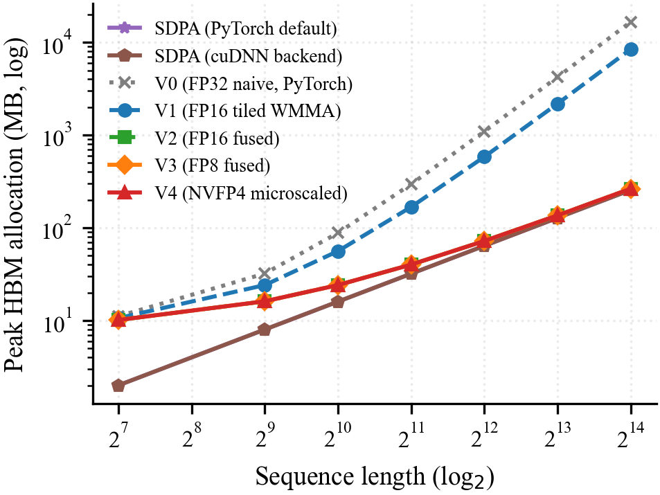

# Mixed-Precision Attention on the RTX 5080

> CMP 674 — Parallel Computing with GPUs · Hacettepe University · Spring 2026

Five attention kernels, written from scratch in CUDA and inline PTX, on a
single consumer Blackwell GPU. Each kernel changes one thing at a time
relative to its predecessor — so the gain (or loss) at every step
isolates exactly one optimization.

The interesting part isn't that the fastest one is fast. It's that the
**lowest-precision one (NVFP4) ends up slower** than its FP8 predecessor,
which is the opposite of what the recent FP4-attention papers report on
the RTX 5090. We think the reason is the software microscaling overhead
on the consumer-Blackwell SMEM idiom, and we're still investigating.

## Hardware

- NVIDIA GeForce RTX 5080 (Blackwell, `sm_120a`, 84 SMs, 16 GB GDDR7)
- CUDA 12.8, PyTorch 2.9.1+cu128, Windows 11
- 5th-gen Tensor Cores with native FP8 (E4M3) and FP4 (NVFP4)

## The five variants

| | Precision | Algorithm | Implementation |
|---|---|---|---|
| **V0** | FP32 | 3 separate kernels, full N×N in HBM | naive CUDA |
| **V1** | FP16 | 3 kernels with tiling | `nvcuda::wmma` (Tensor Cores) |
| **V2** | FP16 | single fused kernel, online softmax | `wmma` + dynamic SMEM |
| **V3** | FP8 (E4M3) | fused + register-resident accumulator | inline PTX `mma.sync.m16n8k32` |
| **V4** | FP4 (E2M1) | fused + per-row, per-K-block microscaling | inline PTX `mma.sync.kind::f8f6f4` |

V0 is the correctness oracle — everything else is checked against it.

## Results

Headline numbers at `seq_len = 8192`, `head_dim = 128`, `batch = 2`, `heads = 8`:

| Variant | Latency | Peak HBM | Rel L2 vs FP32 | vs SDPA |
|---|---:|---:|---:|---:|
| V1 (FP16 tiled) | 77.1 ms | 2176 MB | 6e-4 | 0.16× |
| V2 (FP16 fused) | 60.9 ms | 128 MB | 3e-4 | 0.20× |
| **V3 (FP8)** | **25.8 ms** | 128 MB | 5e-2 | **0.48×** |
| V4 (NVFP4) | 33.4 ms | 128 MB | 0.21 | 0.37× |
| PyTorch SDPA | 12.3 ms | 128 MB | 3e-4 | 1.00× |

The full Pareto frontier:



Three findings worth calling out:

**1. Memory wall breaks at V2 (17×).** Adding online softmax + fusion
cuts peak HBM from 2176 MB to 128 MB at `N = 8192`. No precision
change — pure algorithm.



**2. V3 closes half the SDPA gap.** FP8 mma plus a register-resident
output accumulator gives a 2.4× speedup over V2 and reaches roughly
half of PyTorch's SDPA throughput.

**3. V4 is _slower_ than V3 by ≈30%.** The per-mma cost of software
microscaling (≈12 register ops × 96 mma calls per iteration) outweighs
FP4's throughput advantage. This is the result we're still
investigating — the hardware-microscaled `mxf4nvf4.m16n8k64`
instruction would likely flip it, but its operand layout is
incompatible with the row-major SMEM idiom V3/V4 share. That route is
documented as deferred work.

One bonus methodological finding: SDPA on this PyTorch wheel
dispatches to the **MATH backend only** — Flash, cuDNN, and Memory-
Efficient backends are runtime-disabled. So our "SDPA baseline" is
cuBLAS matmul + softmax, not FlashAttention. Pinning
`FLASH_ATTENTION` via `sdpa_kernel` raises `NoBackendError`.

## Reproducing

The conda `gpu` env has CUDA 12.8 + PyTorch 2.9.1 + Ninja. On Windows:

```powershell
. .\env\activate_for_build.ps1
python env\check_env.py

# Build all five kernels
pip install --no-build-isolation -e kernels\v0_naive_fp32
pip install --no-build-isolation -e kernels\v1_tiled_fp16
pip install --no-build-isolation -e kernels\v2_flash_fp16
pip install --no-build-isolation -e kernels\v3_flash_fp8
pip install --no-build-isolation -e kernels\v4_flash_nvfp4

# Run the full sweep (~30–45 min on RTX 5080)
python bench\run_all.py --config bench\configs\sweep_final.yaml `
    --output bench\results\sweep_final.parquet

# Regenerate every figure from the parquet
python analysis\paper_figures.py

# 495 correctness tests
pytest
```

V4 is the only kernel whose `setup.py` targets `sm_120a` (the
architecture-accelerated variant); plain `sm_120` rejects the
`kind::f8f6f4` mma feature.

To verify Tensor Cores are actually engaged (no admin needed):

```powershell
cuobjdump --dump-sass kernels\v3_flash_fp8\_C.cp311-win_amd64.pyd `
    | Select-String QMMA
# expected: 96 QMMA.16832.F32.E4M3.E4M3 instructions
```

## Repository layout

```
kernels/        five CUDA extensions, one per variant
  v0_naive_fp32/  FP32 baseline (correctness oracle)
  v1_tiled_fp16/  FP16 tiled, WMMA Tensor Cores
  v2_flash_fp16/  FP16 fused, online softmax
  v3_flash_fp8/   FP8 fused, hand-rolled mma.sync (sm_120)
  v4_flash_nvfp4/ NVFP4 fused, software microscaling (sm_120a)
bench/          benchmark harness, sweep configs, results
analysis/       figure-generation scripts
tests/          495 correctness tests against FP32 reference
slides/         course presentation deck (PPTX + Beamer PDF)
figures/        Pareto, latency, memory, accuracy figures
env/            CUDA toolchain validation + Windows build helper
external/       CUTLASS v4.4.2 submodule (reference-only)
```

## Notes I learned the hard way

A few things that cost me hours and aren't in the textbook:

- `__syncthreads()` is required _between_ reduction phases in V0's
  softmax, even when the buffer reads look safe — without it I got a
  nondeterministic ~6% output mismatch that only appeared at large `N`.
- WMMA fragment layout is implementation-defined; that's why V2 has to
  round-trip the output accumulator through SMEM. Inline PTX in V3
  fixes this because the per-thread layout is fully specified.
- The CUTLASS `77_blackwell_fmha` example is gated to `sm_100a`/`sm_103a`
  — there is no FMHA reference for consumer Blackwell as of v4.4.2.
- PowerShell wraps native-command stderr as `NativeCommandError` and
  exits 1 even when the script succeeded. Don't chase the false
  failures.
- Nsight Compute needs admin (`ERR_NVGPUCTRPERM`) on consumer GPUs.
  Use `cuobjdump --dump-sass | Select-String QMMA` for Tensor Core
  engagement instead — it's the actual emitted machine code.

## Limitations

- Single GPU (RTX 5080). The V4 result probably flips on the RTX 5090
  with the hardware-microscaled mma path.
- Forward pass only.
- Clocks not locked (no admin for `nvidia-smi -lgc`); 500 timed iters
  + p95/p99 reporting compensates.
- Tested only on Windows + PyTorch 2.9.1+cu128. The SDPA-dispatch
  finding is specific to this wheel.
